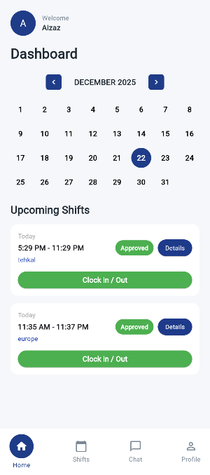

# 📱 EDM Solutions App

A production-focused **Flutter mobile application** built around a real-world **worker ↔ facility/admin workflow**.  
The app handles shift posting, applications, approvals, location-based attendance, payments, and post-completion ratings using clean architecture and API-driven state management.

---

---

## 🧩 Overview

This project is designed as a **role-based system** with two primary user types:

- **Worker**
- **Facility / Admin**

It reflects real business logic, status transitions, and edge cases found in workforce, shift, or ride-based platforms.

---

## 🔁 Core Workflow

### Facility / Admin
- Create and post shifts
- Shifts are published with status **OPEN**
- View worker applications (**PENDING**)
- Approve or reject workers
- Approved shifts move to **FILLED / APPROVED**

### Worker
- View **Available Shifts**
- Apply / claim shifts
- Track application status
- View **Upcoming Shifts** after approval
- Perform:
  - ⏱ Clock In
  - ⏱ Clock Out
- Location is validated during attendance actions

---

## 🚀 Features

- 🔐 Role-based authentication
- 🗓 Shift posting & application flow
- ⏳ Pending / Approved / Filled status handling
- ⏱ Clock In / Clock Out with location validation
- 📍 Location permission & error handling
- ⭐ Post-completion **Rate This Ride / Shift** flow
- 💳 Payment flow integrated with completion lifecycle
- 🏥 Facility/Admin approval management
- 💾 Local database usage for caching & state
- ☁️ REST API–driven architecture
- 🎨 Clean, responsive Flutter UI

---

## 📍 Location Handling

- Location permission is mandatory for attendance
- Validated during:
  - Clock In
  - Clock Out
- Handles:
  - Permission denied
  - Location unavailable
  - User recovery flows

---

## 💳 Payments

- Payments are tied to completed shifts/rides
- Integrated into the worker completion flow
- Payment status is part of core business logic

---

## 💾 Data Management

- Uses a **local database** on the Flutter app
- Supports:
  - Session handling
  - Caching
  - Temporary/offline data
- Backend communication is handled via predefined REST APIs

---

## 🧠 Architecture

- Clean & modular Flutter architecture
- Separation of concerns:
  - UI
  - Business logic
  - Services
- API-based state transitions
- Scalable structure suitable for production apps

